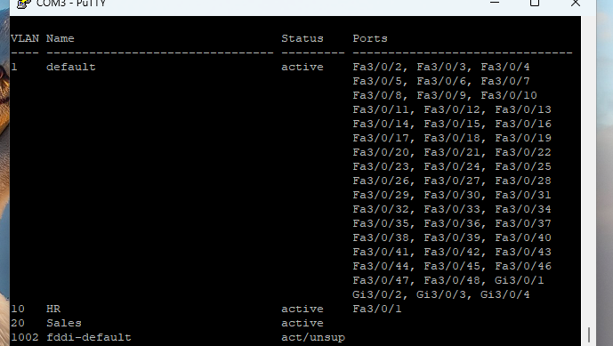
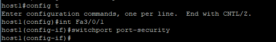
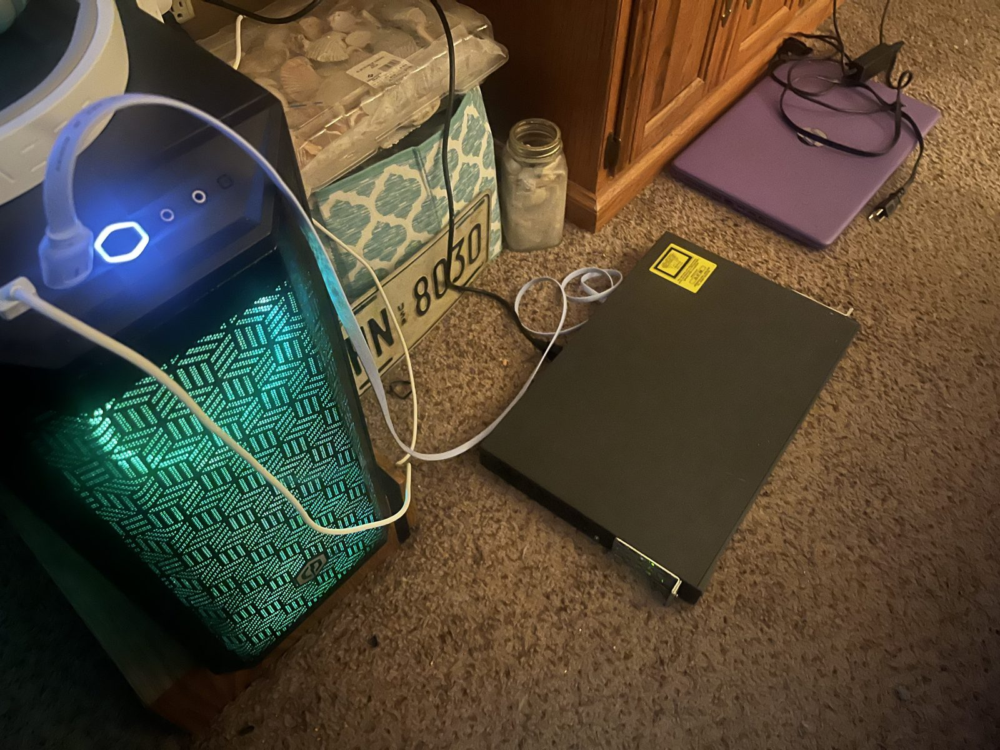
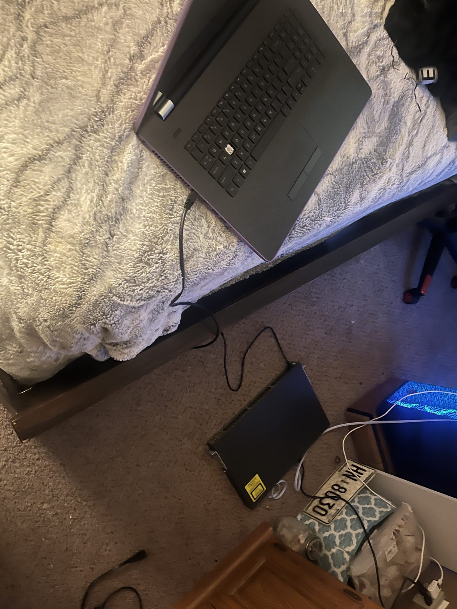

# Cisco Catalyst 3750 Home Lab

A small home lab built around a Cisco Catalyst 3750 switch, used to practice
Layer 2/Layer 3 switching, VLAN segmentation, and basic device hardening as
part of my CCNA studies.

## Why this exists

The 3750 is a full Layer 3 switch, so it's useful for practicing both
switching and routing concepts (VLANs, trunking, inter-VLAN routing) on a
single device — without needing a separate router. This repo documents the
build as I go: what's configured, why, and what's next.

## Topology

```
                 ┌───────────────────────────┐
                 │   Cisco Catalyst 3750      │
                 │       (hostname: host1)    │
                 │                            │
   Console ──────┤ Console Port               │
   (laptop)      │                            │
                 │  VLAN 1   - default/mgmt    │
                 │  VLAN 10  - HR               │
                 │  VLAN 20  - Sales            │
                 │  VLAN 1002 - fddi-default    │
                 │  (system default, unused)    │
                 │                            │
                 │  Fa3/0/1  → VLAN 10 (HR)    │
                 │  Fa3/0/2-48 → VLAN 1 (default)│
                 │  Gi3/0/1-4 → VLAN 1 (default)│
                 └───────────────────────────┘
```

> The switch is managed out-of-band for now via a console cable from a
> laptop (see photos below). SSH/management IP access is on the roadmap.

## Hardware

| Item                  | Role                              |
|-----------------------|------------------------------------|
| Cisco Catalyst 3750   | Core switch — VLANs, L3 routing    |
| Laptop                | Console/terminal access (PuTTY)    |
| PC (workstation)      | Test host / general lab traffic    |

## Current configuration

### VLANs

Two custom VLANs have been created in addition to the default VLAN:

| VLAN | Name | Status | Notes |
|------|------|--------|-------|
| 1    | default | active | Default/management VLAN, all unassigned ports |
| 10   | HR      | active | Assigned to Fa3/0/1 |
| 20   | Sales   | active | No ports assigned yet |
| 1002 | fddi-default | act/unsup | Cisco system-default VLAN, unused |

See [`images/vlan-table.png`](images/vlan-table.png) for the raw
`show vlan brief` output, and
[`configs/vlan-config.md`](configs/vlan-config.md) for the commands used.

### Port security

Port security is being configured on access ports, starting with `Fa3/0/1`,
to restrict which MAC addresses can connect:

```
host1(config)# interface Fa3/0/1
host1(config-if)# switchport port-security
```

See [`images/port-security-config.png`](images/port-security-config.png)
and [`configs/port-security.md`](configs/port-security.md) for the
in-progress config and the full hardening plan (sticky MAC, violation
mode, max MAC count).

### Baseline device hardening

Also applied as part of initial setup — see
[`configs/base-config.md`](configs/base-config.md) for the full commands:

- Hostname, `no ip domain-lookup`
- Local `enable secret` and local user authentication
- SSH enabled on VTY lines (RSA keys generated, domain name set)
- Management IP on VLAN 1

## Photos

| | |
|---|---|
|  | `show vlan brief` output |
|  | Port security being applied to Fa3/0/1 |
|  | Physical setup — switch connected via console cable |
|  | Physical setup — console laptop and switch |

## Roadmap

Planned next steps, roughly in order:

- [ ] Assign remaining access ports to VLAN 10/20 and trunk an uplink port
- [ ] Enable `ip routing` and configure SVIs for inter-VLAN routing
- [ ] Finish port security (sticky MAC, violation action, max MAC addresses)
- [ ] Management IP + SSH-only remote access (disable Telnet)
- [ ] Verify/tune Spanning Tree (Rapid PVST+, root bridge priority)
- [ ] DHCP snooping + dynamic ARP inspection on access VLANs
- [ ] Basic ACLs between VLANs
- [ ] Syslog + SNMP for basic monitoring

## Repo layout

```
.
├── README.md
├── configs/
│   ├── base-config.md        # hostname, auth, SSH, mgmt IP
│   ├── vlan-config.md        # VLAN creation + port assignment
│   └── port-security.md      # port security plan/commands
└── images/
    ├── vlan-table.png        # show vlan brief
    ├── port-security-config.png
    ├── lab-photo-1.jpg
    └── lab-photo-2.jpg
```

---

*Part of my IT/networking home lab, built while studying for CCNA.*
